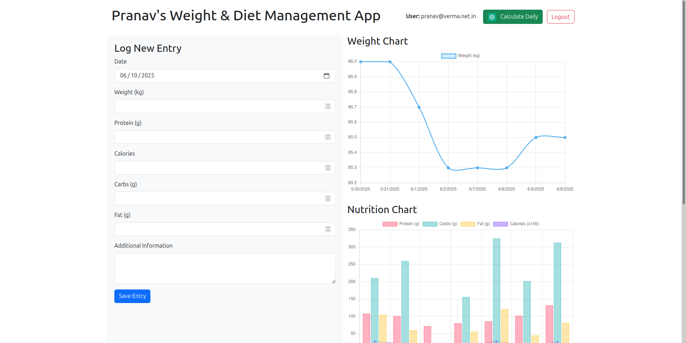

# Weight & Diet Management App

A web application for tracking weight, nutrition, and diet information using PocketBase as the backend.



## Features

- Track weight over time with graphical visualization
- Log nutrition data (protein, carbs, fat, calories)
- Add notes to each entry
- Edit and delete existing entries
- User authentication
- Responsive design (works on mobile and desktop)

## Setup Guide

### Prerequisites

- Node.js and npm
- PocketBase instance (self-hosted or cloud)
- Basic understanding of web servers

### 1. Setting Up PocketBase

1. **Download and Install PocketBase**

   Download PocketBase from [pocketbase.io](https://pocketbase.io/) or use their cloud service.

2. **Start PocketBase**

   ```bash
   ./pocketbase serve
   ```

3. **Access the Admin UI**

   Open `http://127.0.0.1:8090/_/` in your browser and create an admin account.

4. **Create the Required Collections**

   In the PocketBase Admin UI:

   a. Create a `weight` collection with the following schema fields:
   
   | Field Name   | Type     | Required |
   |--------------|----------|----------|
   | logDate      | Date     | Yes      |
   | logWeight    | Number   | Yes      |
   | logProtein   | Number   | No       |
   | logCalories  | Number   | No       |
   | logCarbs     | Number   | No       |
   | logFat       | Number   | No       |
   | logMiscInfo  | Text     | No       |

   b. Configure security rules for the `weight` collection:
   
   Go to the "Rules" tab for the weight collection and set:
   
   - Create Rule: `@request.auth.id != ''`
   - Read Rule: `@request.auth.id != ''`
   - Update Rule: `@request.auth.id != ''`
   - Delete Rule: `@request.auth.id != ''`
   
   This ensures only authenticated users can access the data.

   c. To restrict access to only one specific user with ID `your_user_id`, use:
   
   ```
   @request.auth.id = "your_user_id"
   ```

5. **Create a User Account**

   In the "Users" collection, create a user with an email and password for accessing your app.

### 2. Configuring the Application

1. **Clone this repository**

   ```bash
   git clone https://github.com/yourusername/weight-manager.git
   cd weight-manager
   ```

2. **Update the PocketBase URL**

   Edit the [`app.js`](js/app.js) file to point to your PocketBase instance:

   ```javascript
   // Find this line (near the top of the file)
   const pb = new PocketBase("https://pb-2.pranavv.co.in");
   
   // Replace with your PocketBase URL
   const pb = new PocketBase("http://your-pocketbase-url.com");
   // or for local development
   // const pb = new PocketBase("http://127.0.0.1:8090");
   ```

3. **Customize the App (Optional)**

   - Change the app title in `index.html`
   - Update styling in the CSS section
   - Modify any features to suit your needs

### 3. Serving the Application

#### Option 1: Using a Simple HTTP Server (Development)

```bash
# Install http-server globally
npm install -g http-server

# Start the server
http-server -p 5500
```

The app will be available at `http://localhost:5500`

#### Option 2: Using SystemD (Production)

1. **Install http-server globally**

   The service requires the `http-server` package to be installed globally:

   ```bash
   # Install http-server globally using npm
   sudo npm install -g http-server
   
   # Verify the installation and check its path
   which http-server
   # This should show /usr/local/bin/http-server
   ```

2. **Configure the service file**

   The repository already includes a `weight-manager.service` file. Edit it to update the user and paths if needed:

   ```bash
   # Open the service file to edit
   nano weight-manager.service
   ```
   
   Ensure these values match your system:
   ```
   User=your_username
   WorkingDirectory=/path/to/weight-manager
   ExecStart=/usr/local/bin/http-server -p 5500
   ```
   
   Note: If `which http-server` showed a different path, update the ExecStart line accordingly.

3. **Create a symlink to the systemd directory**

   ```bash
   # Create a symlink to the systemd directory
   sudo ln -sf $(pwd)/weight-manager.service /etc/systemd/system/
   
   # Reload systemd to recognize the new service
   sudo systemctl daemon-reload
   
   # Enable and start the service
   sudo systemctl enable weight-manager
   sudo systemctl start weight-manager
   ```

3. **Check the service status**

   ```bash
   sudo systemctl status weight-manager
   ```

The app should now be running on port 5500 and will automatically start on system boot.

#### Option 3: Using Nginx or Apache (Production)

For production environments, it's recommended to serve the app through Nginx or Apache.

**Nginx Example Configuration:**

```nginx
server {
    listen 80;
    server_name your-domain.com;

    root /var/www/weight-manager;
    index index.html;

    location / {
        try_files $uri $uri/ /index.html;
    }
}
```

## Using the Application

1. Navigate to the app URL
2. Log in using your PocketBase user credentials
3. Use the form on the left to add new weight and nutrition entries
4. View your progress in the charts
5. Manage entries through the data table at the bottom

## Troubleshooting

- **Authentication Issues**: Make sure your PocketBase URL is correct and your user credentials are valid
- **CORS Errors**: Ensure PocketBase is configured to allow requests from your app's domain
- **Chart Not Displaying**: Check if you have entries in the database
- **Service Not Starting**: Check the service logs with `journalctl -u weight-manager`

## License

This project is licensed under the MIT License - see the LICENSE file for details.

## Acknowledgments

- [PocketBase](https://pocketbase.io/) for the backend
- [Bootstrap](https://getbootstrap.com/) for the UI components
- [Chart.js](https://www.chartjs.org/) for data visualization